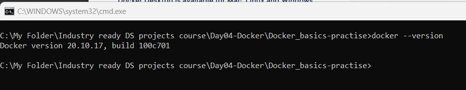
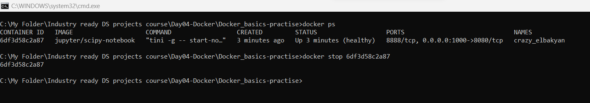

# Docker_basics-practise

docker --version Displays the version of the Docker installed in the local machine

docker info Displays the information about Docker

docker pull Pulls or Downloads the Docker Image from Dockerhub

docker images Shows the list of Docker Images

docker ps Shows the list of active Docker containers

docker stop <container id> Stops the container

docker run -dp <hostport>:<container port> image id Builds the container locally using the mentioned image id

docker container ls -a Displays all Docker containers(Both Inactive and active)

docker rm <containerid>   Deletes the mentioned Docker container

docker rmi -f image_name Deletes the Docker image

docker build -t image_name . Build the docker image by referring Dockerfile

docker run -dp hostport:containerport image_name Starts building the container 

docker build -t userprofile/imagename .   Creating Docker image in useraccount dockerhub(This image name can be anything, it refers to Dockerfile, Images will be build on Dockerfile configuration)

docker push userprofile/image_name:tag_name   Pushes the image to user's Dockerhub

Downloads the docker image to local system

